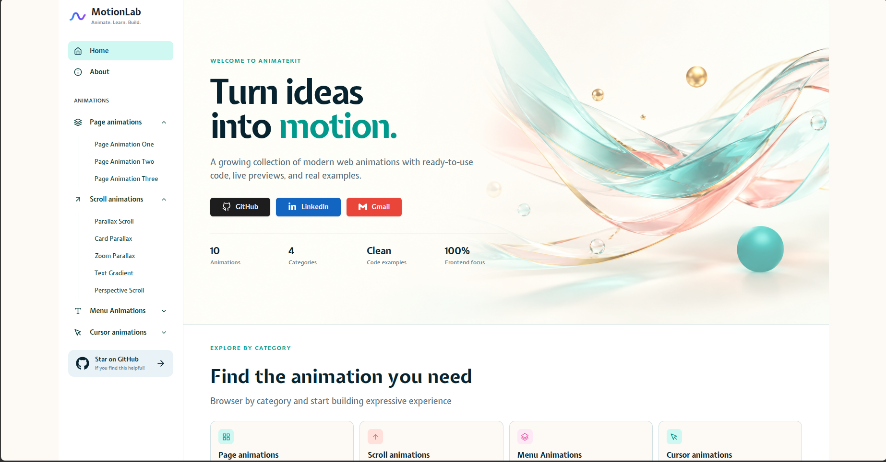

# AnimateKit



AnimateKit is a React-based animation gallery for exploring, learning, and reusing modern web animations.

The project includes interactive examples for page transitions, scroll effects, parallax interactions, menu animations, cursor effects, and more. Every example includes a live preview and reusable source code.

## Live Demo

[Visit AnimateKit](https://animate-kit.store/)

## Features

- Interactive animation gallery
- Live animation previews
- Page transition animations
- Scroll and parallax animations
- Menu and sidebar animations
- Cursor and mask effects
- Responsive layouts
- React Router navigation
- Motion-powered interactions
- Reusable source code examples
- Vercel Analytics integration

## Tech Stack

- React 19
- Vite
- React Router
- Motion
- Tailwind CSS
- React Icons
- React Syntax Highlighter
- Lenis
- Vercel Analytics
- ESLint

## Getting Started

### Prerequisites

- Node.js 18 or later
- npm

### Installation

```bash
git clone https://github.com/rajul2911/animate-kit.git
cd animate-kit
npm install
npm run dev
```

Open the local URL shown in the terminal, usually:

```text
http://localhost:5173
```

## Available Scripts

| Command | Description |
| --- | --- |
| `npm run dev` | Starts the Vite development server |
| `npm run build` | Creates a production build |
| `npm run preview` | Previews the production build locally |
| `npm run lint` | Runs ESLint |

## Animation Categories

### Page Animations

- Page Animation One
- Page Animation Two
- Page Animation Three

### Scroll Animations

- Parallax Scroll
- Card Parallax
- Zoom Parallax
- Text Gradient
- Perspective Scroll

### Menu Animations

- Sidebar Curve
- Sidebar Menu

### Cursor Animations

- Mask Cursor
- Sticky Cursor

```

## Project Structure

```text
animate-kit/
├── public/
│   ├── favicon.svg
│   └── icons.svg
├── src/
│   ├── App.jsx                    # Application routes
│   ├── App.css                    # Application styles
│   ├── index.css                  # Global styles and Tailwind theme
│   ├── main.jsx                   # React entry point
│   ├── assests/                   # Images and media assets
│   │   ├── about/
│   │   ├── Card_Scroll_Parallax/
│   │   ├── Home/
│   │   ├── Mask-Cursor/
│   │   ├── Parallax Scroll Images/
│   │   ├── Perspective-scroll/
│   │   ├── Zoom_Parallax_Scroll/
│   │   ├── motionlab.png
│   │   ├── righticon.png
│   │   └── text.png
│   ├── components/                # Animation implementations
│   │   ├── CursorAnimation/
│   │   │   ├── Mask-Cursor/
│   │   │   └── Sticky-Cursor/
│   │   ├── MenuAnimation/
│   │   │   ├── MenuOne/
│   │   │   └── MenuTwo/
│   │   ├── PageAnimationAll/
│   │   │   ├── PageAnimationOne/
│   │   │   ├── PageAnimationTwo/
│   │   │   ├── PageAnimationThree/
│   │   │   └── PageNavbar.jsx
│   │   └── ScrollAnimationAll/
│   │       ├── CardScrollParallax/
│   │       ├── Parallax Scroll/
│   │       ├── Perspective-Section-Transition/
│   │       ├── TextGradient/
│   │       └── ZoomParallax/
│   ├── pages/                     # Page-level layouts and views
│   │   ├── About.jsx
│   │   ├── OverallPage.jsx
│   │   ├── Home/
│   │   │   ├── Card.jsx
│   │   │   ├── Category.jsx
│   │   │   ├── Footer.jsx
│   │   │   └── MainPage.jsx
│   │   └── SideBar/
│   │       └── SideBar.jsx
│   └── utils/
│       └── AnimaResusable.jsx     # Shared animation UI
├── eslint.config.js
├── index.html
├── package.json
├── vercel.json
├── vite.config.js
└── README.md
```

## How the Project Works

`src/App.jsx` defines the gallery preview routes and the standalone live animation routes.

`src/pages/OverallPage.jsx` provides the shared application shell with the responsive sidebar and page content area.

The homepage and navigation are located in:

```text
src/pages/Home/
src/pages/SideBar/
```

Animation implementations are organized by category inside:

```text
src/components/
```

Images, icons, and other media are stored in:

```text
src/assests/
```

## Adding a New Animation

1. Create the animation component inside the appropriate folder in `src/components/`.
2. Add required images or media inside `src/assests/`.
3. Add a preview route in `src/App.jsx`.
4. Add a live route for the standalone animation.
5. Add the animation to the relevant navigation or category component.
6. Test the animation on desktop and mobile screens.
7. Run the validation commands.

Example component location:

```text
src/components/ScrollAnimationAll/MyNewAnimation/MyNewAnimation.jsx
```

Example routes:

```jsx
<Route path="/my-animation" element={<MyAnimationShow />} />
<Route path="/my-animation-live" element={<MyAnimation />} />
```

## Validation

Before submitting changes, run:

```bash
npm run lint
npm run build
```

To preview the production build:

```bash
npm run preview
```

## Contribution Guidelines

- Keep changes focused and organized.
- Reuse existing components and project patterns.
- Keep animations responsive.
- Test keyboard, pointer, and touch interactions.
- Add meaningful `alt` text to images.
- Avoid unnecessary dependencies.
- Make sure new routes work when opened directly.
- Check that animations do not create horizontal overflow.
- Respect reduced-motion preferences where appropriate.
- Run `npm run lint` and `npm run build` before opening a pull request.

## License

This project is licensed under the MIT License.

## Maintainer

Created and maintained by [Rajul Gupta](https://github.com/rajul2911).

- GitHub: [github.com/rajul2911](https://github.com/rajul2911)
- LinkedIn: [linkedin.com/in/rajulgupta2911](https://linkedin.com/in/rajulgupta2911)
- Email: [rajulgupta2911@gmail.com](mailto:rajulgupta2911@gmail.com)